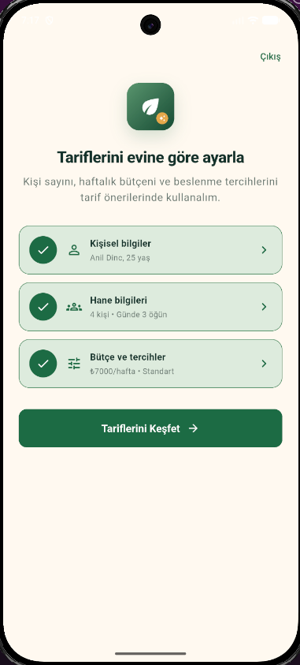
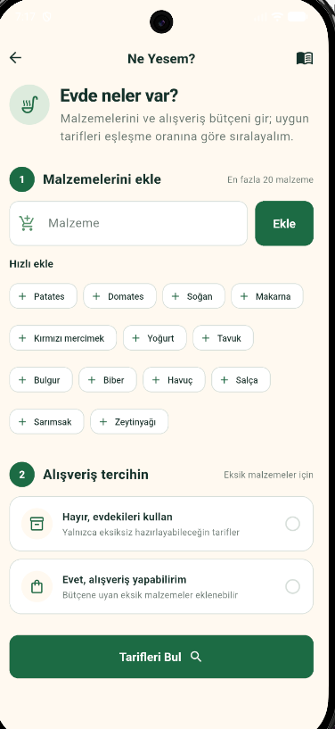
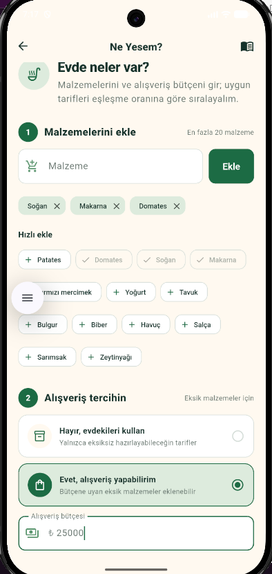
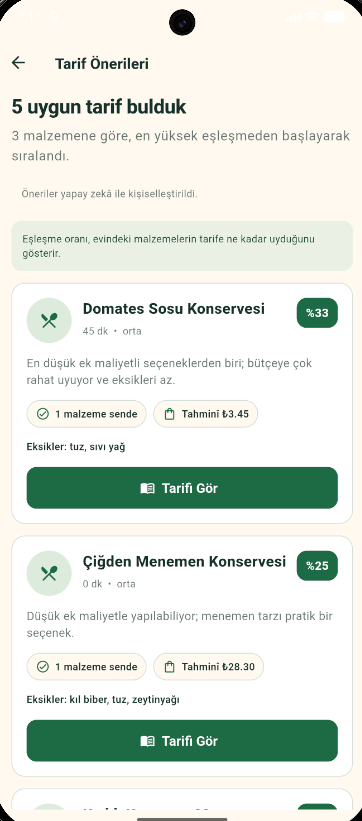
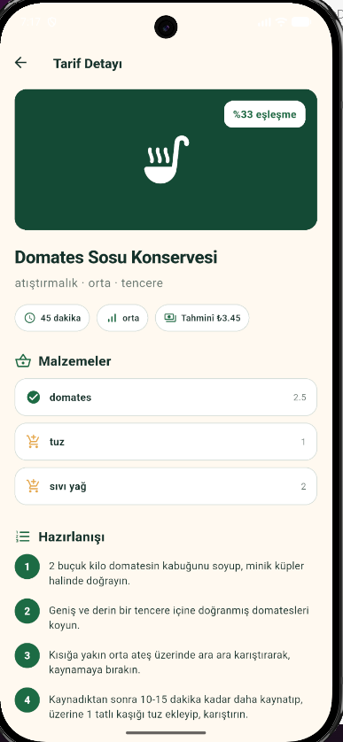
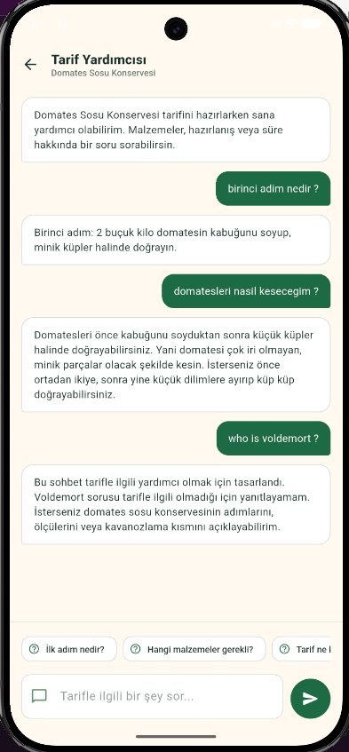

# Bereket AI

Bereket AI, evdeki malzemeleri, haftalık bütçeyi ve yemek tercihlerini birlikte değerlendirerek uygun tarifler öneren bir mutfak asistanıdır. Google Yapay Zeka ve Teknoloji Akademisi Bootcamp 2026 kapsamında Takım 134 tarafından geliştirilmektedir.

## Canlı bağlantılar

| İçerik | Adres |
| --- | --- |
| Jüri ve ürün merkezi | [bereket.app](https://bereket.app) |
| Canlı API durumu | [api.bereket.app/api/v1/health](https://api.bereket.app/api/v1/health) |
| API dokümanı | [api.bereket.app/api/docs](https://api.bereket.app/api/docs) |
| Sprint 1 demosu | [bereket.app/sprint-1-demo](https://bereket.app/sprint-1-demo) |

## Ürün ne yapıyor?

- Kullanıcı hesabı, profil, hane ve bütçe bilgilerini yönetir.
- Evdeki malzemeleri tarif kataloğuyla karşılaştırır.
- Bütçe, yemek tercihi ve alerjen bilgisine göre uygun tarifleri sıralar.
- Seçilen tarif hakkında tarife bağlı sohbet desteği sunar.
- Eksik veya tahminî maliyet bilgisini kesin fiyat gibi göstermez.

## Üç sprintlik gelişim

- **Sprint 1:** Next.js ve shadcn/ui ile hazırlanan, sabit veriler kullanan web prototipi.
- **Sprint 2:** Flutter kullanıcı akışları ve mobil uygulamanın kullanabileceği mock backend.
- **Sprint 3:** Gerçek tarif verisi, kullanıcı sistemi, canlı öneri servisi, tarif sohbeti ve production altyapısı.

Sprint branch'leri ürünün gelişimini sırasıyla korur: `sprint-1` → `sprint-2` → `sprint-3`.

## Güncel teslim durumu

Backend, tarif veri seti ve öneri sistemi `api.bereket.app` üzerinde çalışmaktadır. API; kayıt/giriş, profil, tarif listeleme, tarif önerisi ve tarife özel sohbet akışlarını sunar.

Flutter uygulaması `mobile` branch'inde production API'ye bağlanmıştır. Kayıt/giriş, profil GET/PATCH, güvenli token saklama ve refresh mutex, tarif kataloğu ve detayı, kişiselleştirilmiş öneriler, nullable/tahminî maliyetler ve kalıcı tarife özel sohbet akışları gerçek servislerle çalışmaktadır. `flutter analyze` hatasız, 16 otomatik test başarılı ve Android release APK derlemesi tamamlanmıştır.

Fiziksel cihaz doğrulaması, production uygulama kimliği/imzası, mağaza yayını ve iOS signing/build işlemleri ürün geliştirmesinden ayrı yayın adımlarıdır. Bu adımlar tamamlanana kadar sürüm `v1.0.0-rc.1` olarak korunur.

## Mobil uygulama

| Profil ve tercihler | Malzeme girişi | Bütçe ve alışveriş |
| --- | --- | --- |
|  |  |  |

| Öneriler | Tarif detayı | Tarife özel asistan |
| --- | --- | --- |
|  |  |  |

## Veri seti

Canlı sistemde 3.005 benzersiz tarif ve 27.382 malzeme satırı bulunmaktadır. Maliyet bilgisi bulunan malzemeler tahminî değer olarak kullanılır; eksik fiyatlar sıfır kabul edilmez.

Ayrıntılı veri istatistikleri ve doğrulama bilgileri [production durum belgesinde](docs/production-status.md) yer alır.

## Branch yapısı

| Branch | İçerik |
| --- | --- |
| `sprint-1` | İlk web prototipi |
| `sprint-2` | Mobil tasarım ve mock backend aşaması |
| `sprint-3` | Jüri merkezi ve güncel proje dokümantasyonu |
| `backend` | Canlı NestJS API ve öneri sistemi |
| `mobile` | Flutter uygulaması |

İlk Gemini/RecipeNLG agent araştırması aktif branch listesinden çıkarılmış ve `archive/agent-gemini-prototype` etiketiyle arşivlenmiştir. Production agent `backend` branch'indedir.

## Takım 134

- Sıla KARATAŞ — Product Owner
- Burak BAŞODA — Scrum Master, veri
- Ceren KARABAĞ — Agent kalite ve değerlendirme
- Anıl DİNÇ — Flutter
- Samet DÖNMEZ — Backend ve platform

## Yerel çalıştırma

Node.js 24 ve pnpm 10.34.5 gerekir.

```bash
pnpm install
pnpm dev
pnpm lint
pnpm build
```

## Dokümantasyon

- [Sprint 1 planı](docs/sprint-1-plani.md), [review](docs/sprint-1-review.md), [retrospective](docs/sprint-1-retrospective.md)
- [Sprint 2 planı](docs/sprint-2-plani.md), [review](docs/sprint-2-review.md), [retrospective](docs/sprint-2-retrospective.md)
- [Sprint 3 planı](docs/sprint-3-plani.md), [review](docs/sprint-3-review.md), [retrospective](docs/sprint-3-retrospective.md)
- [Daily Scrum notları](docs/daily-scrum-notlari.md)
- [Ürün gereksinimleri](docs/product-requirements.md)
- [Demo senaryosu](docs/demo-senaryosu.md)
- [Teknik mimari](docs/architecture.md)
- [Canlı sistem durumu](docs/production-status.md)
