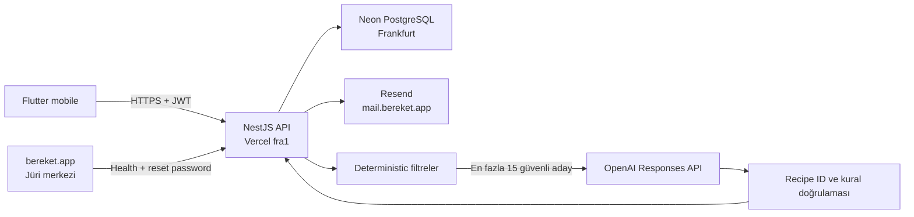

# Production Mimarisi

## Çalışma zamanı

## Güvenlik sınırları

1. Kullanıcı kimliği yalnız doğrulanmış JWT `sub` alanından alınır.
2. Alerjen ve bütçe kuralları OpenAI çağrısından önce uygulanır.
3. OpenAI’ye parola, token, e-posta veya kullanıcı entity’si gönderilmez.
4. Her model çıktısı aday recipe ID listesine karşı tekrar doğrulanır.
5. Timeout, rate limit, geçersiz çıktı ve bütçe sınırında deterministic fallback çalışır.
6. Aylık maliyet, PostgreSQL üzerinde atomik rezervasyonla 5 USD sınırında tutulur.

## Veri güvenilirliği

Dataset importu checksum kontrollü ve idempotent’tir. Aktif veri sürümü bütün tarifler yazıldıktan sonra transaction ile değişir. Eksik fiyatlar nullable kalır; maliyetler tahminî, alerjen verisi `inferred` olarak sunulur.
