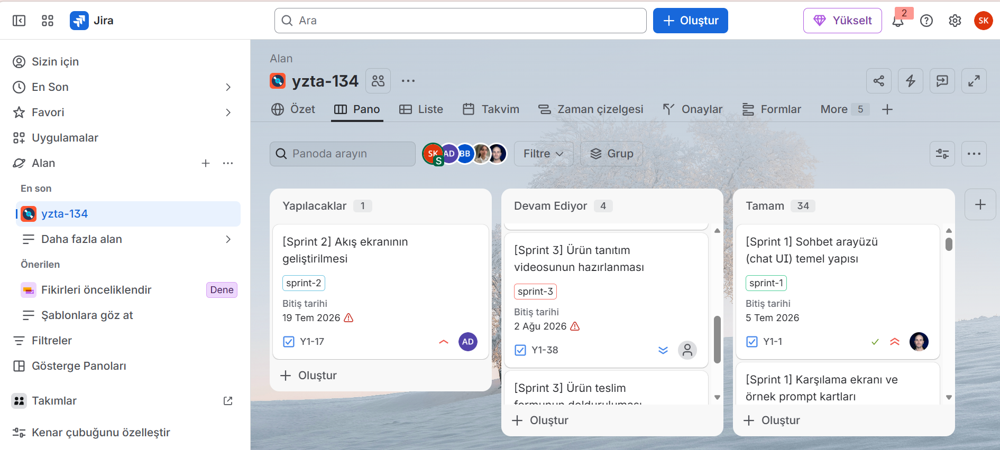

# Sprint 3 Planı

## Sprint Hedefi

Sprint 2'de hazırlanan mobil ve backend altyapısını gerçek tarif verisiyle çalışan, canlıya alınabilir bir sisteme dönüştürmek. Backend ve agent tarafı production ortamında hazırlandıktan sonra mobil uygulamanın bu servislere bağlanması hedeflenir.

## Sprint Kapsamı

- Production kullanıcı kayıt, giriş ve parola sıfırlama akışları
- Profil, hane, bütçe, tercih ve alerjen yönetimi
- 3.005 tariflik veri setinin veritabanına aktarılması
- Malzeme normalizasyonu, bütçe ve alerjen kontrolleri
- Gerçek veriye dayalı tarif önerileri
- Seçilen tarife özel sohbet
- Canlı API, API dokümanı ve jüri merkezi
- Backend testleri ve canlı ortam kontrolleri
- Flutter uygulamasının canlı API entegrasyonu

## Görev ve Durum

| Alan | Sprint 3 çıktısı | Durum |
| --- | --- | --- |
| Ürün | Sprint dokümanları, Jira takibi ve demo akışı | Tamamlandı |
| Veri | Tarif verisi, maliyet kapsamı ve malzeme normalizasyonu | Tamamlandı |
| Agent | Tarif önerisi ve tarife özel sohbet akışı | Backend üzerinde tamamlandı |
| Backend | Auth, profil, tarif, öneri, sohbet ve production yayını | Tamamlandı |
| Mobil | Canlı API, güvenli oturum, tarif, öneri ve sohbet entegrasyonu | Tamamlandı |

## Kabul Kriterleri

- `api.bereket.app` sağlık kontrolü ve API dokümanı erişilebilir olmalıdır.
- Kullanıcı kayıt, giriş, token yenileme ve parola sıfırlama akışları çalışmalıdır.
- Profil bilgileri kaydedilebilmeli ve güncellenebilmelidir.
- Öneriler yalnız veri setindeki tariflerden oluşmalıdır.
- Bütçe ve alerjen kuralları öneriden önce uygulanmalıdır.
- Model servisi kullanılamadığında sistem temel tarif sıralamasıyla yanıt verebilmelidir.
- Tarif sohbeti yalnız seçilen tarif bağlamında çalışmalıdır.
- Mobil uygulama bu API sözleşmesini kullanarak uçtan uca akışı tamamlamalıdır.

## Sprint Board

Sprint görevleri Jira üzerinde takım tarafından takip edilmektedir. Board görüntüsü sprint kapanış anını arşivler; sonrasında tamamlanan mobil production entegrasyonu güncel teslim dokümanlarında ayrıca doğrulanmıştır.

## Kapsam Dışı

- Canlı market fiyatı entegrasyonu
- Barkod veya fiş okuma
- Çoklu dil desteği
- Uygulama mağazası operasyonlarının backend ekibi tarafından yürütülmesi

## Başlıca Riskler

- Mobil istemci modelleriyle API sözleşmesinin farklılaşması
- Tarif verisindeki eksik fiyatların kesin maliyet gibi yorumlanması
- Alerjen bilgisinin kullanıcı tarafından doğrulanmadan kesin kabul edilmesi
- Dış servis kesintileri

## Sprint Çıkışı

Backend, gerçek tarif verisi, agent akışları ve Flutter production entegrasyonu hazırdır. Sprint 3 ürün geliştirmesi kapanmıştır; fiziksel cihaz, production imzalama ve mağaza operasyonları release sürecinde izlenir.
